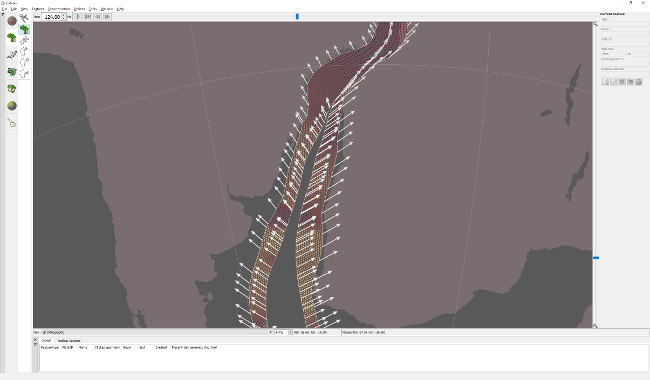

郑友玉到达如龙山庄的时候天将亮而未亮，正是黎明前最黑暗和阴冷的时刻。

两三个时辰之前郑友玉在炼玉谷外痛失墨玉乌骓，他现在急需一匹好脚力赶去瀞湖水寨，如龙山庄地处炼玉谷东南三十多里，庄主与郑友玉有旧，山庄盛产宝马良驹。

说起这如龙山庄和郑友玉颇有渊源，那匹墨玉乌骓便是如龙马场主人丁财旺在十年前所赠。当时郑友玉击败辽东剑魔一战成名，丁旺财不远千里前去道贺，宝马赠英雄。郑友玉也算没辜负丁旺财的一番苦心，骑着墨玉乌骓走南闯北，不仅为自己，同时也为如龙马场闯出了江湖盛名。如龙马场渐渐地由名不见经传变得名满天下，养出的马在江湖上更是千金难求。

五年前如龙马场培育出了两匹神驹，追风和逐云。丁旺财更是在御马监花大价钱上下打点，从而得到进贡御马的机会。当朝天子爱马如痴，这两匹马若得皇帝宠爱，那丁旺财成为红顶商人便是板上钉钉的事了。送御马进京兹事体大，丁旺财不但派遣爱子丁隐丁儒隆带领一众高手护送，更邀郑友玉一同前往。不巧当时郑友玉远在千里之外，山高水远不及赶回，由于进贡之期万不能延误，于是飞鸽传书相约在半路会合。路上果然出了岔子，幸好郑友玉及时赶到，联手丁隐大破五湖七寇，夺回御马。追风和逐云果然深受皇帝喜爱，自那之后，如龙马场渐渐取代了三秦御马堂为朝廷军队提供战马，丁家也因此深受皇恩，丁隐挂了游击将军之职。

应门的不是通常的门房老王，而是郑友玉从未见过的老高，据老高说老王回老家探亲去了，郑友玉也并未在意，便跟着老高进了打更的门房。

如龙山庄地处偏远，不比市井豪门大户，没有很多更夫护院，门房不大，仅容得一人起居过活。老高知道郑友玉是当世大侠并与庄主一家颇有交情，所以即便深夜造访，招应得还算周全，不但沏了一壶高碎满天星，更是嫌油灯昏暗特地加点了两只蜡烛。

“郑大侠，您先歇歇脚，我这就去请老爷。”老高点完蜡烛就出门往后院去了，临走还不忘把门关好，看来是个仔细的更夫。

郑友玉嘬了两口茶，又苦又涩，是那飲驴的蠢物罢了，于是便不再喝，在房内床上盘膝打坐调息。经炼玉谷一战郑友玉内力损耗不少，难得此刻可以静坐调息恢复内力。

过不多时，郑友玉渐渐觉得疲乏，昏昏欲睡。他心中一惊，暗叫不好，连忙运一道真气冲破肾经玄关穴，只觉后腰两侧
一阵剧烈刺痛，立刻睡意全无。待他仔细环顾屋内，发现两根蜡烛的火苗上散发着袅袅青烟，若不留意很难察觉。郑友玉心中暗骂自己不小心，知道这是老高搞鬼，一个门房怎么会点得起蜡烛？又怎么会在屋内备有蜡烛？

郑友玉连忙用掌风震熄蜡烛和油灯，在黑暗中飞身躲到了门后。几乎在屋内灯光熄灭的同时，只听得屋外传来弓弦和羽箭破空之声，十几支箭由窗户射入了屋内。此时的郑友玉早已躲在了门后，抬腿一脚踢飞了房门，自己却破窗而出，径直向羽箭射来的方向追去。

还未追出两步，突然黑暗中跑出一个女人的身影，径直朝郑友玉奔来，及近依稀可辨，不是别人，正是潇湘剑赵亦婷。这赵奕婷一脸血污，衣衫凌乱，甚是狼狈。

郑友玉见状疾步迎上前去，不想突然脚下一步踏空，身子一栽，眼前一黑，坠落深渊。

郑友玉猛然惊醒，原来是一场梦魇，自己依旧在门房里打坐，定睛看时，屋内烛火明亮，老高还未回来。郑友玉自嘲地笑了笑，想是连日奔波，更被人追杀，由此而得此梦。

郑友玉因为一场怪梦心绪难平，难以入定调息，于是便下得床来，在屋里来回踱步，仔细检查了那两只蜡烛，也并未见异样，唯觉口内一股苦杏仁味道，经久不去，也并未太过在意。正百无聊赖之际，只听得屋外隐隐似有打斗之声，于是开门循声找去。

来到一处庭院，天色已经渐渐泛白，只见两个蒙面黑衣人正在夹攻一个女人，这女人的衣着竟然和刚才梦见的赵亦婷相仿，唯发髻凌乱，看不太清容貌。手中一长一短两口剑，看似赵亦婷的潇湘双剑。

郑友玉看到这些蒙面的鸡鸣狗盗之徒就怒火中烧，无论是不是赵亦婷都要上前助拳。正待上前，突然女人一个趔趄，门户大开，被其中一个黑衣人趁机将长剑打落在地。女人见势不妙，转身便朝郑友玉方向跑来。这场景和郑友玉刚才的噩梦倒有七分相似。郑友玉有些恍惚。

女人慌不择路，步伐凌乱，脚下绊蒜，眼见就要跌倒，黑衣人正要背后插刀。紧急关头郑友玉未及多想，飞身上前，一把揽住女人胳膊，拉到自己身后，顺势一挥碧尤剑逼退黑衣人。

两个黑衣人见状突然转身拔足狂奔，仿佛早有准备。郑友玉心中暗叫不好，紧接着后腰一阵剧痛传来。身后女人的短剑已经插入了郑友玉的后腰。

若是平日，郑友玉的护体罡气多半可以将这一剑弹开，但现在郑友玉真气还未完全恢复，护体罡气虽然勉强激发，但只减弱了短剑力道，拇指长短的剑身依旧刺进了皮肉。

女人并不贪心，短剑刺出的同时身形已经开始向后跃起，意图很明显，不管刺中刺不中，逃命是首要任务。郑友玉转身左掌拍向女人，女人已经在一步开外了，但依旧被郑友玉的掌风震到，趔趄了几部步倒在了地上。郑友玉正欲上前去制服女人，突然身边出现八个大汉将他团团围住。女人趁机从地上爬起来，越过墙头消失了。

这八个大汉每人手里握着一对子午鸡爪鸳鸯钺，他们乃是八卦门门下关中八杰。这八个人倒是光明磊落，逐一抱拳拱手自报家门。赵钱孙李周吴郑王…

“此次咱们哥们儿在此恭候郑大侠，是要了结七年前的一桩公案。”这领头儿的赵乾谈吐还算得体。

七年前？八卦门？郑友玉一时想不起来有什么公案。

看到郑友玉没有马上答话，似乎有些困惑，吴x. 立刻火冒三丈，骂骂咧咧地吼道:“咋？不记得了？打了俺们的人还装没事儿？”

赵乾瞪了吴X 一眼。吴某偷眼看了看钱坤，钱坤示意吴某少安毋躁。赵乾又看了一眼钱坤，皱了皱眉。钱坤连忙避开了赵乾的目光。这一连串貌似不经意的动作都被郑友玉看在眼里，猜测这八卦门内也不平静。

郑友玉想不起来跟八卦门有啥梁子。猜测也就是多年前可能不经意打了他们的人，介于当时郑友玉如日中天，八卦门也就摸摸鼻子忍了。如今八卦门估计是加入了“倒郑联盟”，铁了心要跟郑友玉对着干了，所以随便找了个借口罢了。当然这个“倒郑联盟”也不过是郑友玉的猜测罢了，也有可能只是关中八杰单纯的想要扬名立万而已。

郑友玉后腰的伤不再疼痛，而是感觉麻木在伤口附近扩散。郑友玉暗骂一声，知道短剑上定是煨了毒药，这毒药会使肌肉僵化麻木，并会渐渐蔓延全身，直到中毒者心脏麻痹而死。无奈大敌当前，不能打坐调息驱毒，郑友玉只好暗运真气减缓毒性扩散。

“来吧。”多说无益，八卦门今天就是来找茬打架的。郑友玉随便摆了个架势，示意八杰动手。

“郑大侠武功盖世，若单打独斗，我们哥儿八个当然自愧不如，但我们师傅传授了一套八卦阵法，抖胆向郑大侠讨教…”赵乾行走江湖中规中矩，还在客套。

“哪那么多废话！”郑友玉没了耐心，纵身上前就打。

郑友玉后腰有伤，需要速战速决。但关中八杰有备而来，只守不攻，把郑友玉围在中心，打算把他拖死。要破这种铁桶阵只能耐心等待布阵的人犯错，但郑友玉今天受伤中毒，时间拖越长对他越不利。

郑友玉决定在吴某身上打开突破口，因为他看起来比较鲁莽急躁，犯错机会比较大。郑友玉盯着吴某一阵急攻猛打，若在平日吴某必定在郑友玉的极限施压下手忙脚乱章法大乱，但今日郑友玉先是在炼玉谷耗损大量真气，刚刚又中毒挨刀，再加上这八杰轮防，协防和补防走位都确实相当出色，郑友玉竟然久攻不下。

随着时间推移，郑友玉渐渐显露败相，出手开始变慢，脚下开始绊蒜。八杰几乎已经开始喜形于色了。

决定胜负的那一刻来得比八杰想象的还要快。郑友玉出剑攻吴某，钱坤上了协防，郑友玉本该撤剑变招，可是他突然脚下不稳，碧尤剑撤得慢了半拍。

一个巨大的机会摆在了钱坤面前，如果他现在出手用鸡爪钺锁住碧尤剑，这场仗就结束了，明天江湖上就会盛传他的美名，说不定这将是他的时代的开启。如果他现在不出手，按部就班地打，不出一柱香时间郑友玉一样会败，但那时的功劳就会属于八杰，尤其是大哥赵乾。

电光火石间，钱坤决定出手赌一把。鸡爪钺与碧尤剑接触的那一霎那，郑友玉露出了一丝几乎难以察觉的微笑。钱坤的心突然一沉。

